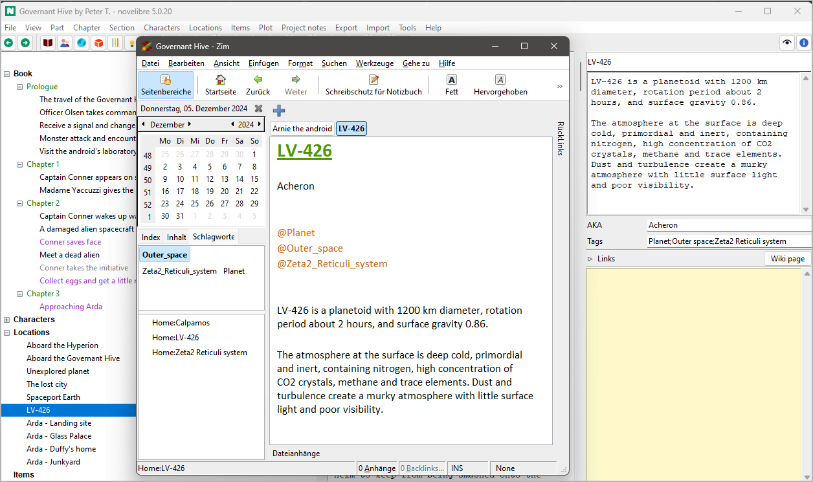

# nv_zim

The [novelibre](https://github.com/peter88213/novelibre/) Python program helps authors organize novels.
Although it can take up characters, locations, and items in order to trace their occurrence in the story,
*novelibre* is not meant as a tool for extensive world building. 
For describing, grouping, and organizing the people, places, and things in your story world, a wiki is much better.

*nv_zim* is a plugin that manages the connection with a [Zim Desktop Wiki](https://zim-wiki.org/).

## Features

- Lets you connect an existing Zim notebook as a *project wiki* with the *novelibre* project.
- Lets you create a new project wiki that is either blank, or populated with all
  characters, locations, and items of the *novelibre* project.
- Adds **Wiki page** link buttons to the book/characters/locations/items/ properties.
  Clicking on a link button opens the corresponding *Zim* wiki page, if existing. 
  Otherwise, a new project wiki page can be created. 
- Newly created wiki pages contain descriptions and other meta data. 
  *novelibre* tags are adopted, so they are a powerful navigation aid in the wiki.
- Wiki pages among the regular links are recognized and opened with the *Zim* application.

## Requirements

- [novelibre](https://github.com/peter88213/novelibre/) version 5.17+
- [Zim Desktop Wiki](https://zim-wiki.org/)

  For Windows, I recommend the most recent 32-bit Zim version 0.69.1, which is fast and proven. 
  The Windows installer for this release is no longer available from the official download site, 
  but can be found [on the former maintainer's web site](https://zim.glump.net/windows/). 

## Download and install

### Default: Executable Python zip archive

Download the latest release [nv_zim_v5.2.0.pyzw](https://github.com/peter88213/nv_zim/raw/main/dist/nv_zim_v5.2.0.pyzw)

- Launch *nv_zim_v5.2.0.pyzw* by double-clicking (Windows/Linux desktop),
- or execute `python nv_zim_v5.2.0.pyzw` (Windows), resp. `python3 nv_zim_v5.2.0.pyzw` (Linux) on the command line.

#### Important

Many web browsers recognize the download as an executable file and offer to open it immediately. 
This starts the installation.

However, depending on your security settings, your browser may 
initially  refuse  to download the executable file. 
In this case, your confirmation or an additional action is required. 
If this is not possible, you have the option of downloading 
the zip file. 

### Alternative: Zip file

The package is also available in zip format: [nv_zim_v5.2.0.zip](https://github.com/peter88213/nv_zim/raw/main/dist/nv_zim_v5.2.0.zip)

- Extract the *nv_zim_v5.2.0* folder from the downloaded zipfile "nv_zim_v5.2.0.zip".
- Move into this new folder and launch *setup.pyw* by double-clicking (Windows/Linux desktop), 
- or execute `python setup.pyw` (Windows), resp. `python3 setup.pyw` (Linux) on the command line.

---

[Changelog](docs/changelog.md)

## Usage

See the [online manual](https://peter88213.github.io/nvhelp-en/nv_zim/)

---

## Credits

- The Zim icon is from the [Zim Desktop Wiki](https://github.com/zim-desktop-wiki/zim-desktop-wiki) repository, 
  licensed under [GPLv2](https://www.gnu.org/licenses/gpl-2.0.en.html).

## License

This is Open Source software, and the *nv_zim* plugin is licensed under GPLv3. See the
[GNU General Public License website](https://www.gnu.org/licenses/gpl-3.0.en.html) for more
details, or consult the [LICENSE](https://github.com/peter88213/nv_zim/blob/main/LICENSE) file.
